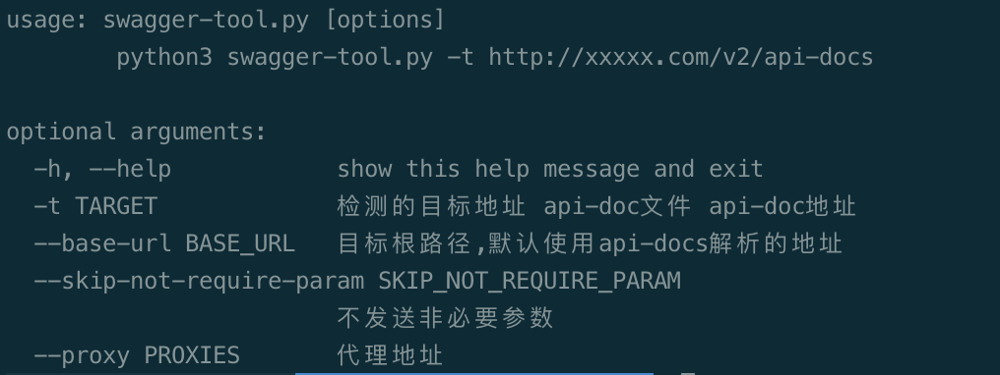
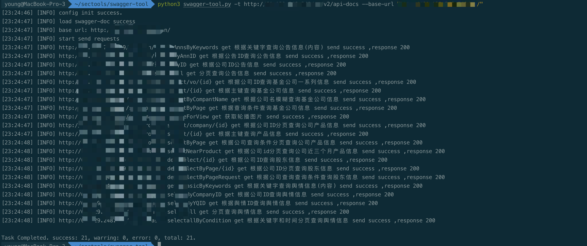

# swager-ui 接口爬取发送工具

### 前言
之前在做测试的时候，遇到swager-ui，想要快速提取接口，方便后续的测试和扫描，因此编写了这个工具。

目前支持get，post方法，支持form、json格式参数请求，以满足大多数场景，其他方法等后续遇到相应文档再做适配。

### 主要用途
* 快速发送接口数据，查看接口信息
* 将接口数据代理到burp、xray、proxyscan等工具
* 批量设置参数，校验越权等

### 使用方式
* \-t : 目标地址，支持api-docs的url地址 或者api-docs的json格式文件
* \--base-url : 接口的根路径，有些时候根路径和文件解析到的根路径不一致，可使用这个参数来设置api的根路径
* \--skip-not-require-param : 不发送非必须参数
* \--proxy :  设置发送时的代理


### 更多配置
default\_value.py配置文件中可设置默认参数，主要包括以下方面

```python
#!/usr/bin/env python
# -*- coding: utf-8 -*-
# 参数对应的默认的参数值
default_value_dict = {
    'pageSize': 10,
    'pageNo': 1,
}

# 如果没有默认参数值，将根据参数类型设置以下默认值
default_type_value_dict = {
    'integer': 1,
    'int32': 1,
    'int64': 1,
    'string': 'test',
    'number': 10,
    'boolean': False,
    'object': '',
    'array': [],

    'null': 'testnull'
}

# 公共请求头
common_headers_dict = {
    'token': 'xxxx'
}

# 公共参数
common_params_dict = {}
```


### 工具截图








